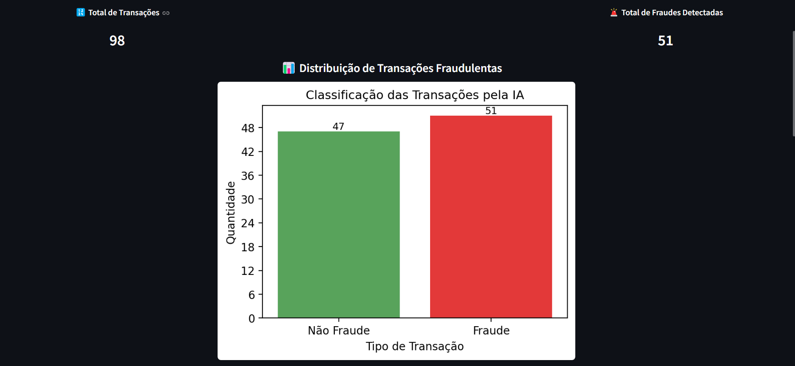
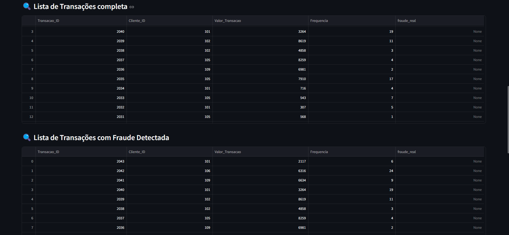
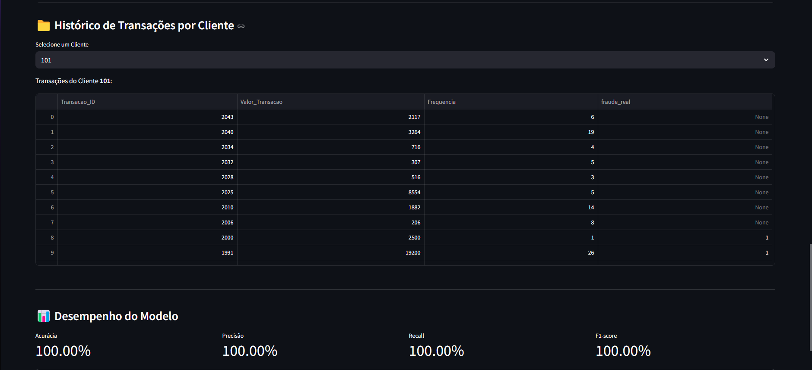

# 🚀 GuardPay

Este projeto simula um sistema de detecção de fraudes em transações financeiras. Utilizando aprendizado de máquina supervisionado, 
o sistema analisa dados de clientes e suas transações para identificar comportamentos suspeitos.

---

## 🎯 Objetivo

O objetivo do projeto é desenvolver uma aplicação prática que utilize técnicas de machine learning para identificar transações financeiras suspeitas com base no histórico de comportamento dos clientes.
A solução foca em oferecer uma visualização amigável para análise e tomada de decisão, sem exigir a visualização de código, o que é ideal para apresentações acadêmicas e executivas.

O projeto está diretamente relacionado ao conteúdo da disciplina Linguagens Formais e Autômatos, ao aplicar regras formais e classificação de padrões com base em dados rotulados.
A detecção de fraudes é realizada através de aprendizado supervisionado, utilizando o algoritmo Random Forest treinado a partir de um histórico de transações já identificadas como fraudulentas ou não.

---

## 👨‍💻 Tecnologias Utilizadas

Liste as principais tecnologias, linguagens, frameworks e bibliotecas utilizadas:

- Python 3.12
- Streamlit
- MySQL
- Pandas
- Scikit-learn
- Matplotlib / Seaborn
- Joblib
- NumPy

---

## 🗂️ Estrutura do Projeto

```
📦project-guardpay
├── 📁 DB
│   ├── guardpay.sql
├── 📁 guardpay
│   ├── app.py
│   ├── db.py
│   ├── modelo.py
│   └── utils.py
├── 📁 logo
│   └── logo.png
├── 📁 modelo
├── └── modelo_treinado.pkl
├── README.md
└── requirements.txt
```

---

## ⚙️ Como Executar

### ✅ Rodando Localmente

1. **Clone o repositório:**
   - git clone https://github.com/N1netyN1ne/GuardPay-Project

2. **Acesse a pasta do projeto:**
    - cd guardpay-project

3. **(Opcional) Crie e ative um ambiente virtual:**
    - python -m venv venv

4. **Instale as dependências:**
    - pip install -r requirements.txt

5. **Importe o Banco de Dados** 
    - Acesse http://localhost/phpmyadmin
    - Crie o banco chamado guardpay
    - Digite o comando **USE guardpay**
    - Vá na aba Importar
    - Escolha o arquivo guardpay.sql fornecido em DB/guardpay.sql
    - Clique em Executar
    
6. **Como Executar**
    - No terminal, execute:
    - python -m streamlit run guardpay/app.py

---

## 📸 Demonstrações

- **Tela inicial**


- **Grafico de exibição**


- **Listas de transações**


- **Historico por cliente**

---

## 👥 Equipe

| Nome | GitHub |
|------|--------|
| Ryan Dias | [@N1netyN1ne](https://github.com/N1netyN1ne) |
| Alexandre Vinhola | [@alexandrevinhola](https://github.com/alexandrevinhola) |

---

## 🧠 Disciplinas Envolvidas

- Linguagens Formais e Autômatos

---

## 🏫 Informações Acadêmicas

- Universidade: **Universidade Braz Cubas**
- Curso: **Ciência da Computação**
- Semestre: 6º/7º
- Período: Manhã
- Professora orientadora: **Dra. Andréa Ono Sakai**
- Evento: **Mostra de Tecnologia 1º Semestre de 2025**
- Local: Laboratório 12
- Datas: 05 e 06 de junho de 2025

---

## 📄 Licença

MIT License — sinta-se à vontade para utilizar, estudar e adaptar este projeto.
